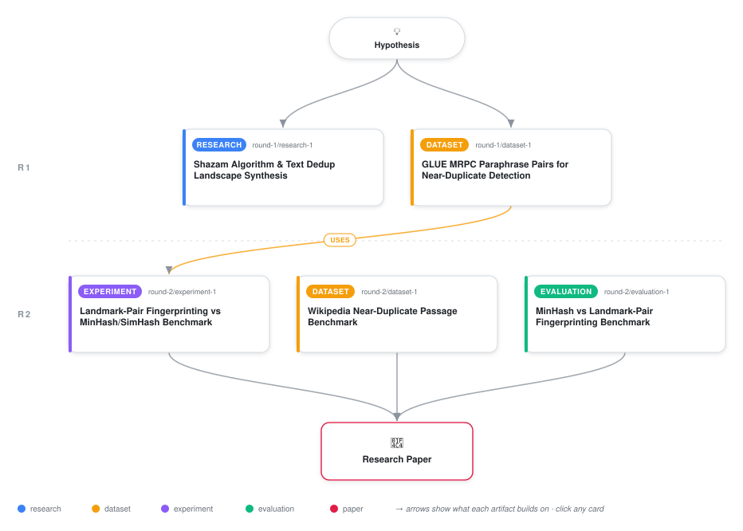

# Landmark-Pair Fingerprinting for Text: Cross-Domain Transfer Without Advantage

<div align="center">

<a href="https://cdn.jsdelivr.net/gh/AMGrobelnik/ai-invention-cb9424-landmark-pair-fingerprinting-for-text-cr@main/workflow.svg">
<picture>
  <source media="(prefers-color-scheme: dark)" srcset="workflow-dark.svg">
  
</picture>
</a>

<sub>🖱️ <b><a href="https://cdn.jsdelivr.net/gh/AMGrobelnik/ai-invention-cb9424-landmark-pair-fingerprinting-for-text-cr@main/workflow.svg">Open the interactive diagram</a></b> — every card links to its artifact folder.</sub>

</div>

> **TL;DR** — This work explores adapting Shazam's audio landmark-pair fingerprinting to text near-duplicate detection. Experiments show the cross-domain transfer is mechanistically novel but empirically fails: MinHash Containment (a simple asymmetric metric) achieves equal performance, and the positional offset component actually hurts recall on realistic data (z=-4.68, p<0.001). The paper documents why: text landmarks are brittle to paraphrasing, text-scale is too small for positional structure to help, and containment MinHash already solves the problem. This is a negative-result paper contributing honest analysis of cross-domain transfer boundaries.

<details>
<summary>Full hypothesis</summary>

Adapting Shazam's landmark-pair audio fingerprinting to text near-duplicate detection — hashing (ngram_A, ngram_B, position_delta) triples of locally-salient n-gram landmarks — does NOT outperform MinHash Containment (|A∩B|/|A|) on structural-edit near-duplicates (insertion, deletion, embedding, reordering). Moreover, the positional offset component — the core innovation from Shazam — is actively harmful on realistic text, reducing recall by ~4pp relative to co-occurrence-only landmark pairs (z=-4.68, p<0.001 on GLUE MRPC). The null result has two layers: (1) MinHash Containment, a well-established but underutilized metric fix, already achieves perfect recall (1.0) on all synthetic structural-edit types tested, leaving no gap for landmark-pair to fill; (2) on genuine paraphrase detection (MRPC), landmark-pair achieves recall@P≥0.90 = 0.11–0.32 versus MinHash Jaccard's 0.30–0.61, demonstrating that text n-gram landmarks are too brittle to serve as stable anchor points. The transfer fails for three domain-specific reasons: text landmarks (n-gram TF-IDF peaks) are brittle to minor lexical variation unlike audio spectral peaks; sentence-scale text (10–30 words) yields only 5–10 landmarks, too few for offset-discriminative pairing; and the structural robustness problem that motivated the work is already solved by asymmetric containment. The contribution of this work is therefore the documented failure of this cross-domain transfer, the mechanistic explanation of why it fails, and empirical evidence that MinHash Containment should be the standard baseline for structural near-duplicate detection before more complex methods are explored.

</details>

[](https://cdn.jsdelivr.net/gh/AMGrobelnik/ai-invention-cb9424-landmark-pair-fingerprinting-for-text-cr@main/paper.pdf) [](https://github.com/AMGrobelnik/ai-invention-cb9424-landmark-pair-fingerprinting-for-text-cr/tree/main/paper_latex)

This repository contains all **5 artifacts** produced across **2 rounds** of an autonomous AI research run — round by round, exactly in the order they were invented.

## Round 1

| Artifact | Type | Demo | Source | Builds on |
|----------|------|------|--------|-----------|
| **[Shazam Algorithm & Text Dedup Landscape Synthesis](https://github.com/AMGrobelnik/ai-invention-cb9424-landmark-pair-fingerprinting-for-text-cr/tree/main/round-1/research-1)** | [](https://github.com/AMGrobelnik/ai-invention-cb9424-landmark-pair-fingerprinting-for-text-cr/tree/main/round-1/research-1) | [](https://github.com/AMGrobelnik/ai-invention-cb9424-landmark-pair-fingerprinting-for-text-cr/blob/main/round-1/research-1/demo/research_demo.md) | [](https://github.com/AMGrobelnik/ai-invention-cb9424-landmark-pair-fingerprinting-for-text-cr/tree/main/round-1/research-1/src) | — |
| **[GLUE MRPC Paraphrase Pairs for Near-Duplicate Detection](https://github.com/AMGrobelnik/ai-invention-cb9424-landmark-pair-fingerprinting-for-text-cr/tree/main/round-1/dataset-1)** | [](https://github.com/AMGrobelnik/ai-invention-cb9424-landmark-pair-fingerprinting-for-text-cr/tree/main/round-1/dataset-1) | [](https://colab.research.google.com/github/AMGrobelnik/ai-invention-cb9424-landmark-pair-fingerprinting-for-text-cr/blob/main/round-1/dataset-1/demo/data_code_demo.ipynb) | [](https://github.com/AMGrobelnik/ai-invention-cb9424-landmark-pair-fingerprinting-for-text-cr/tree/main/round-1/dataset-1/src) | — |

## Round 2

| Artifact | Type | Demo | Source | Builds on |
|----------|------|------|--------|-----------|
| **[Landmark-Pair Fingerprinting vs MinHash/SimHash Benchmark](https://github.com/AMGrobelnik/ai-invention-cb9424-landmark-pair-fingerprinting-for-text-cr/tree/main/round-2/experiment-1)** | [](https://github.com/AMGrobelnik/ai-invention-cb9424-landmark-pair-fingerprinting-for-text-cr/tree/main/round-2/experiment-1) | [](https://colab.research.google.com/github/AMGrobelnik/ai-invention-cb9424-landmark-pair-fingerprinting-for-text-cr/blob/main/round-2/experiment-1/demo/method_code_demo.ipynb) | [](https://github.com/AMGrobelnik/ai-invention-cb9424-landmark-pair-fingerprinting-for-text-cr/tree/main/round-2/experiment-1/src) | <sub><i>uses:</i><br/>[dataset‑1&nbsp;(R1)](https://github.com/AMGrobelnik/ai-invention-cb9424-landmark-pair-fingerprinting-for-text-cr/tree/main/round-1/dataset-1)</sub> |
| **[Wikipedia Near-Duplicate Passage Benchmark](https://github.com/AMGrobelnik/ai-invention-cb9424-landmark-pair-fingerprinting-for-text-cr/tree/main/round-2/dataset-1)** | [](https://github.com/AMGrobelnik/ai-invention-cb9424-landmark-pair-fingerprinting-for-text-cr/tree/main/round-2/dataset-1) | [](https://colab.research.google.com/github/AMGrobelnik/ai-invention-cb9424-landmark-pair-fingerprinting-for-text-cr/blob/main/round-2/dataset-1/demo/data_code_demo.ipynb) | [](https://github.com/AMGrobelnik/ai-invention-cb9424-landmark-pair-fingerprinting-for-text-cr/tree/main/round-2/dataset-1/src) | — |
| **[MinHash vs Landmark-Pair Fingerprinting Benchmark](https://github.com/AMGrobelnik/ai-invention-cb9424-landmark-pair-fingerprinting-for-text-cr/tree/main/round-2/evaluation-1)** | [](https://github.com/AMGrobelnik/ai-invention-cb9424-landmark-pair-fingerprinting-for-text-cr/tree/main/round-2/evaluation-1) | [](https://colab.research.google.com/github/AMGrobelnik/ai-invention-cb9424-landmark-pair-fingerprinting-for-text-cr/blob/main/round-2/evaluation-1/demo/eval_code_demo.ipynb) | [](https://github.com/AMGrobelnik/ai-invention-cb9424-landmark-pair-fingerprinting-for-text-cr/tree/main/round-2/evaluation-1/src) | — |

## Repository Structure

Artifacts are grouped by the round of invention that produced them. Each
artifact has its own folder with source code and a self-contained demo:

```
.
├── round-1/                         # One folder per round of invention
│   ├── experiment-1/
│   │   ├── README.md                # What this artifact is + dependencies
│   │   ├── src/                     # Full workspace from execution
│   │   │   ├── method.py            # Main implementation
│   │   │   ├── method_out.json      # Full output data
│   │   │   └── ...                  # All execution artifacts
│   │   └── demo/                    # Self-contained demo
│   │       └── method_code_demo.ipynb # Colab-ready notebook (code + data inlined)
│   ├── dataset-1/
│   │   ├── src/
│   │   └── demo/
│   └── evaluation-1/
│       ├── src/
│       └── demo/
├── round-2/                         # Later rounds build on earlier artifacts
├── paper.pdf                        # Research paper
├── paper_latex/                     # LaTeX source files
├── workflow.svg                     # Artifact dependency diagram (this page's header)
└── README.md
```

## Running Notebooks

### Option 1: Google Colab (Recommended)

Click the "Open in Colab" badges above to run notebooks directly in your browser.
No installation required!

### Option 2: Local Jupyter

```bash
# Clone the repo
git clone https://github.com/AMGrobelnik/ai-invention-cb9424-landmark-pair-fingerprinting-for-text-cr
cd ai-invention-cb9424-landmark-pair-fingerprinting-for-text-cr

# Install dependencies
pip install jupyter

# Run any artifact's demo notebook
jupyter notebook <artifact_folder>/demo/
```

## Source Code

The original source files are in each artifact's `src/` folder.
These files may have external dependencies - use the demo notebooks for a self-contained experience.

---
*Generated by AI Inventor Pipeline - Automated Research Generation*
